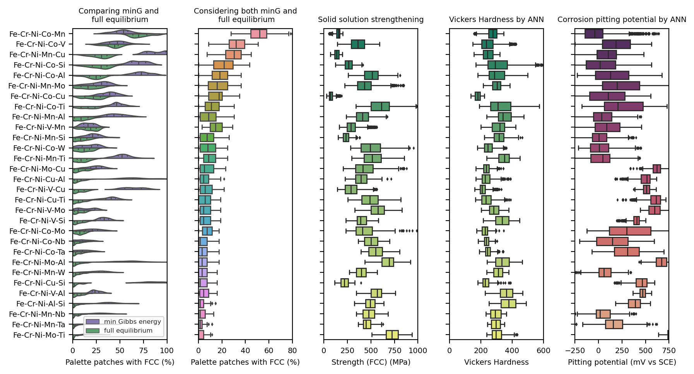

# Harnessing representation in exploring compositional complex alloys

This repository provides a platform for performing calculations and evaluations on quinary alloys A-B-C-D-E using computational thermodynamics and machine learning techniques. It focuses on modelling the phase stability and solid solution strengthening, along with hardness and corrosion pitting potential evaluation.

## Objectives

This repository serves to:

- Perform batch calculations for quinary alloys (A-B-C-D-E) using computational thermodynamics.
  - Model phase stability under full equilibrium and minimum Gibbs energy conditions.
  - Model solid solution strengthening for the targeted alloys.
- Evaluate hardness and corrosion pitting potential using a multitask neural network model (based on the `CCA_representation_ML` submodule).
- Facilitate compositional sampling that takes the representation of combinatorial physical vapor deposition (`SputteringCompoMapNormalised.dat`) and permutations of different mixes of neighbouring elements.

## Visuals

The computational results can be illustrated through visuals such as the plots below, demonstrating the FCC alloy formation tendency under varying thermodynamic evaluations and property evaluations by physical-based models. They also show the solid solution strengthening and the properties computed from the neural network models.




## Citation

For more information, refer to:

- Wu et al., "Harnessing representation in exploring compositional complex alloys [under review]", 2023.

## Repository Structure and Features

The directory structure and functionalities are described as follows:

```bash
|-- CCA_CALPHAD_SSS_ML

    |-- v6_A_B_C_D_E_Gmin_FullEquil_SputterCompo_master.m
    |-- v6_A_B_C_D_E_SSS_SputterCompo_master.m
    |-- SputteringCompoMapNormalised.dat
    |-- v6_A_B_C_D_E_Gmin_FullEquil_SputterCompo_batch.m
    |-- v6_A_B_C_D_E_SSS_SputterCompo_batch.m


    |-- v6_A-B-C-D-E_Sputtering_ML

    |-- CCA_representation_ML

    |-- sns_plot.ipynb

|-- v6_Fe_Cr_Ni_Al_Si_Sputtering (not in this repository)
|-- v6_Fe_Cr_Ni_Al_Ta_Sputtering (not in this repository)
|-- ...

```

#### phase stability and solid solution strengthening calculation

`v6_A_B_C_D_E_Gmin_FullEquil_SputterCompo_master.m` performs calculations of phase stability under full equilibrium and minimum Gibbs energy, aiming at obtaining FCC alloys.
`v6_A_B_C_D_E_SSS_SputterCompo_master.m` models the solid solution strengthening for the FCC phase under the same sampled compositions.

#### Machine Learning Submodule

`CCA_representation_ML`: This machine learning submodule, maintained in a separate repository, is utilized for evaluating hardness and corrosion pitting potential.

#### Plotting

`sns_plot.ipynb` to generate summary plots

## tested working environment

```bash
conda create --name tf_1-env python=3.7
conda activate tf_1-env

pip install --upgrade pip
pip install tensorflow==1.14

pip install scikit-learn pandas matplotlib seaborn shap

```

## Download the repositories `CCA_CALPHAD_SSS_ML` and its submodule `CCA_representation_ML` to your local drive

```bash
|-- your local drive
    |-- CCA_CALPHAD_SSS_ML
        |-- CCA_representation_ML
        |-- ...
```

**Pull the repository to the local folder**

```bash
git clone https://github.com/YXWU2014/CCA_CALPHAD_SSS_ML.git
cd CCA_CALPHAD_SSS_ML
```

**Add the submodule**

```bash
git submodule add https://github.com/YXWU2014/CCA_representation_ML.git
```

**Initialise and fetch the submodule**

```bash 
git submodule update --init --recursive
git checkout main
```

<!-- **Commit and push local changes to GitHub**

```bash
cd CCA_CALPHAD_SSS_ML

```

```bash
cd CCA_representation_ML
git add -A
git commit -m "update shap and tc-python"
git push origin main

cd ..
git add  -A
git commit -m "Updated submodule"
git push origin main
```

**Pull the latest repository to the local folder (point to `main` branch)**

```bash
cd CCA_CALPHAD_SSS_ML
```

```bash
git pull origin main

cd CCA_representation_ML
git checkout main
git pull origin main
cd ..
```
-->

#### Used BO search space hyperparameters

- small space:

```python
if Flag_BO_search:
    # Define the search space for hyperparameters
    search_space_NNF_NNH_NNC = [{'name': 'NNF_num_nodes',   'type': 'discrete',  'domain': (32, 64, 128, 256)},  # 0: NNF_num_nodes
                                {'name': 'NNF_num_layers',  'type': 'discrete',
                                    'domain': (1, 2, 3, 4, 5)},  # 1: NNF_num_layers
                                {'name': 'NNH_num_nodes',   'type': 'discrete',
                                    'domain': (32, 64, 128)},  # 2: NNH_num_nodes
                                {'name': 'NNH_num_layers',  'type': 'discrete',
                                    'domain': (1, 2, 3)},  # 3: NNH_num_layers
                                {'name': 'NNC_num_nodes',   'type': 'discrete',
                                    'domain': (32, 64, 128)},  # 4: NNC_num_nodes
                                {'name': 'NNC_num_layers',  'type': 'discrete',
                                    'domain': (1, 2, 3)},  # 5: NNC_num_layers
                                {'name': 'NNF_dropout',     'type': 'continuous',
                                    'domain': (0.1)},         # 6: NNF_dropout
                                {'name': 'NNH_NNC_dropout', 'type': 'continuous',
                                    'domain': (0.1)},         # 7: NNH_NNC_dropout
                                {'name': 'loss_class',      'type': 'discrete',
                                    'domain': (0)},             # 8: loss_class
                                {'name': 'learning_rate_H', 'type': 'discrete',
                                    'domain': (0.0001, 0.0005)},     # 9: learning_rate_H
                                {'name': 'learning_rate_C', 'type': 'discrete',
                                    'domain': (0.0001, 0.0005)},     # 10: learning_rate_C
                                {'name': 'batch_size_H',    'type': 'discrete',
                                    'domain': (16, 32, 64)},  # 11: batch_size_H
                                {'name': 'N_epochs_local',  'type': 'discrete',  'domain': (1, 2, 3)}]       # 12: N_epochs_global
```

- large space:

```python
if Flag_BO_search:
    # Define the search space for hyperparameters

    # loss_encoder == 0: mean_squared_error
    # loss_encoder == 1: mean_absolute_error

    search_space_NNF_NNH_NNC = [{'name': 'NNF_num_nodes',   'type': 'discrete',  'domain': (32, 64, 128, 256)},  # 0: NNF_num_nodes
                                {'name': 'NNF_num_layers',  'type': 'discrete',
                                    'domain': (1, 2, 3, 4, 5, 6)},  # 1: NNF_num_layers
                                {'name': 'NNH_num_nodes',   'type': 'discrete',
                                    'domain': (32, 64, 128, 256)},  # 2: NNH_num_nodes
                                {'name': 'NNH_num_layers',  'type': 'discrete',
                                    'domain': (1, 2, 3, 4, 5, 6)},  # 3: NNH_num_layers
                                {'name': 'NNC_num_nodes',   'type': 'discrete',
                                    'domain': (32, 64, 128, 256)},  # 4: NNC_num_nodes
                                {'name': 'NNC_num_layers',  'type': 'discrete',
                                    'domain': (1, 2, 3, 4, 5, 6)},  # 5: NNC_num_layers
                                {'name': 'NNF_dropout',     'type': 'continuous',
                                    'domain': (0.1, 0.5)},         # 6: NNF_dropout
                                {'name': 'NNH_NNC_dropout', 'type': 'continuous',
                                    'domain': (0.1, 0.5)},         # 7: NNH_NNC_dropout
                                {'name': 'loss_class',      'type': 'discrete',
                                    'domain': (0, 1)},             # 8: loss_class
                                {'name': 'learning_rate_H', 'type': 'continuous',
                                    'domain': (0.0001, 0.01)},     # 9: learning_rate_H
                                {'name': 'learning_rate_C', 'type': 'continuous',
                                    'domain': (0.0001, 0.01)},     # 10: learning_rate_C
                                {'name': 'batch_size_H',    'type': 'discrete',
                                    'domain': (16, 32, 64, 128)},  # 11: batch_size_H
                                {'name': 'N_epochs_local',  'type': 'discrete',  'domain': (1, 2, 3, 4)}]       # 12: N_epochs_global
```
