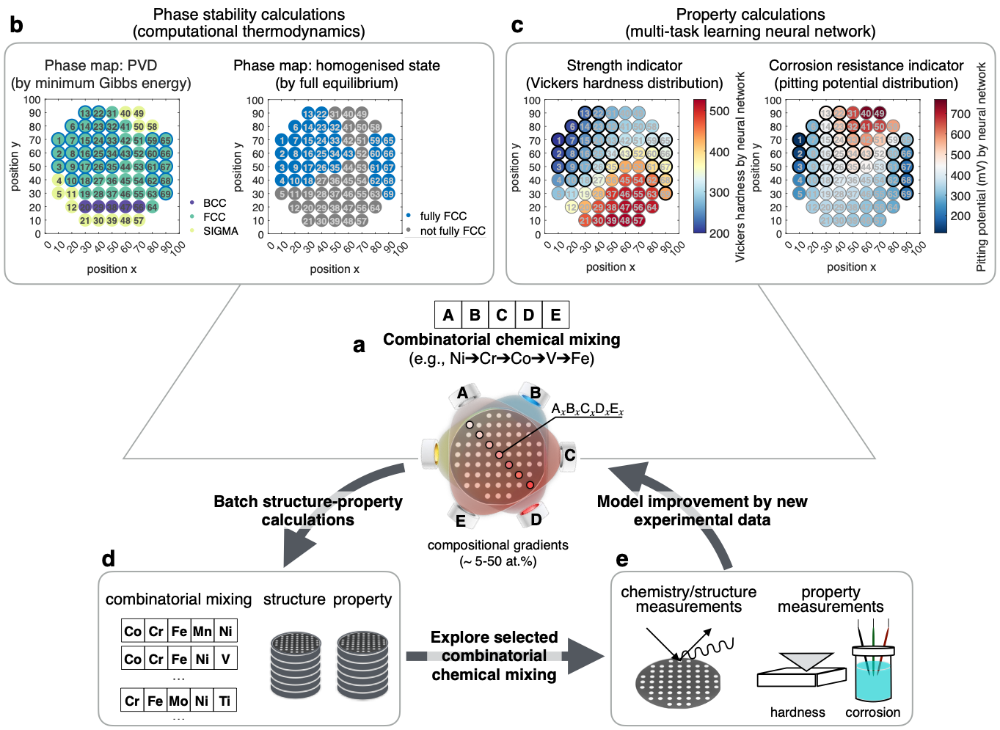

# Informing Combinatorial Exploration of Compositionally Complex Alloys

This repository is associated with the [manuscript](https://github.com/YXWU2014/CCA_CALPHAD_SSS_ML/blob/main/manuscript/Paper_Manuscript.pdf) on informing combinatorial exploration of compositionally complex alloys through integrated CALPHAD, solid-solution-strengthening (SSS), and multitask machine learning workflows.

This repository documents an integrated workflow that combines computational thermodynamics, solid-solution strengthening (SSS), and multitask machine learning to explore compositionally complex alloys (CCAs). The codebase is organized into submodules that cover precomputed alloy-property data and the downstream ML workflow.

- CALPHAD phase-stability and solid-solution-strengthening (SSS) calculations
- multitask ML for hardness and corrosion prediction



## Repository Layout

- `./v6_A-B-C-D-E_Sputtering`: [CALPHAD and SSS workflow](https://github.com/YXWU2014/combinatorial_mixing.git) submodule for permutative combinatorial compositions
- `./CCA_representation_ML`: [ML workflow](https://github.com/YXWU2014/CCA_representation_ML.git) submodule for hardness and corrosion model training, evaluation, prediction, and explainability
- `./v6_A-B-C-D-E_Sputtering_ML`: precomputed CALPHAD/SSS structure-property results for 55 alloy families and 455,400 alloy compositions
- `v6_A_B_C_D_E_Gmin_FullEquil_SputterCompo_master.m`: root entrypoint for phase-stability generation
- `v6_A_B_C_D_E_SSS_SputterCompo_master.m`: root entrypoint for SSS generation
- `SputteringCompoMapNormalised.dat`: composition-grid input used by the MATLAB stages

## Getting Started

### Tested Dependencies and Pip Installation

- Python 3.9.16
- Key libraries listed in `requirements.txt`
- For customized classes and functions, see `./CCA_representation_ML/utils`
- Install dependencies using pip with a Python 3.9.16 environment:

```bash
python -m pip install -r requirements.txt
```

### How to Use the Repo

Clone the repository:

```bash
git clone https://github.com/YXWU2014/CCA_CALPHAD_SSS_ML.git
cd CCA_CALPHAD_SSS_ML
```

Initialize and fetch the submodules:

```bash
git submodule update --init --recursive
git checkout main
```

### MATLAB / Thermo-Calc requirements for the CALPHAD stage

The MATLAB entry scripts invoke Thermo-Calc toolbox functions, so a full CALPHAD rerun requires MATLAB, a working Thermo-Calc setup with the `tc_*` MATLAB interface enabled, access to the `TCHEA4` database, and the local helper library expected by the scripts. If those dependencies are unavailable, the ML stage can still be run against the precomputed data already stored in `v6_A-B-C-D-E_Sputtering_ML/`.

## Run This Repo

### Stage 1: CALPHAD phase stability

This stage is handled in the [`v6_A-B-C-D-E_Sputtering`](https://github.com/YXWU2014/combinatorial_mixing.git) submodule. Run `v6_A_B_C_D_E_Gmin_FullEquil_SputterCompo_master.m` from the repository root in MATLAB. This stage uses `SputteringCompoMapNormalised.dat` to enumerate five-element permutations, compute minimum-G and full-equilibrium phase information, and generate phase-stability figures and summary outputs.

### Stage 2: Solid-Solution Strengthening

This stage is also handled in the [`v6_A-B-C-D-E_Sputtering`](https://github.com/YXWU2014/combinatorial_mixing.git) submodule. Run `v6_A_B_C_D_E_SSS_SputterCompo_master.m` from the repository root in MATLAB. This stage reuses the same sputtering composition grid, computes effective elastic and misfit quantities for FCC compositions, and exports strengthening tables and plots for each permutation.

### Stage 3: computed-data handoff to ML

The ML workflow consumes the computed permutation-composition results generated upstream from the [`v6_A-B-C-D-E_Sputtering`](https://github.com/YXWU2014/combinatorial_mixing.git) submodule and assembled under `v6_A-B-C-D-E_Sputtering_ML/v6_A-B-C-D-E_Sputtering_ML_All_Calc/`, together with the associated CALPHAD and SSS outputs.

### Stage 4: ML training, evaluation, and prediction

This stage is handled in the [`CCA_representation_ML`](https://github.com/YXWU2014/CCA_representation_ML.git) submodule. It is the point where the workflow interfaces with experimental data, combining cleaned hardness and corrosion datasets with CALPHAD/SSS-derived composition inputs in a multitask neural-network pipeline. The workflow reads curated datasets from `01_Dataset_Cleaned/`, uses the main notebooks in `03_Model_Train_Evaluate_Predict/`, and writes trained-model and prediction outputs under `04_Model_Saved/`. For more detail on the ML workflow, notebook structure, and execution steps, see the submodule documentation directly.

## Submodule Guides

- CALPHAD / SSS details: [v6_A-B-C-D-E_Sputtering/README.md](https://github.com/YXWU2014/combinatorial_mixing/blob/main/README.md)
- ML workflow details: [CCA_representation_ML/README.md](https://github.com/YXWU2014/CCA_representation_ML/blob/main/README.md)

## Figure Mapping

The manuscript [Combinatorial exploration of compositionally complex alloys](manuscript/Paper_Manuscript.pdf) contains a number of figures generated through this repository. For interested readers, the main scripts, notebooks, and output locations are linked below.

| Figure                | Description and repository location                                                                                                                                                                                                                                                                                                                                                                                                                                                                                                                                                                                                                                                                                                                                                                                                                                                                       |
| --------------------- | --------------------------------------------------------------------------------------------------------------------------------------------------------------------------------------------------------------------------------------------------------------------------------------------------------------------------------------------------------------------------------------------------------------------------------------------------------------------------------------------------------------------------------------------------------------------------------------------------------------------------------------------------------------------------------------------------------------------------------------------------------------------------------------------------------------------------------------------------------------------------------------------------------- |
| Fig. 1                | Ni-Cr-Co-V-Fe phase-stability maps from `v6_A-B-C-D-E_Sputtering/v6_Fe_Cr_Ni_Co_V_Sputtering/v6_Ni_Cr_Co_V_Fe_Gmin_FullEquil_SputterCompo_master.m`, and hardness/corrosion maps from `v6_A-B-C-D-E_Sputtering/v6_Fe_Cr_Ni_Co_V_Sputtering/v5_Gmin_FullEquil_SputterCompo_Ecorr_Icorr_VHN_ML.m`; outputs are in `v6_A-B-C-D-E_Sputtering/v6_Fe_Cr_Ni_Co_V_Sputtering/`.                                                                                                                                                                                                                                                                                                                                                                                                                                                                                                                                   |
| Fig. 3                | UMAP visualization from `CCA_representation_ML/02_Dataset_EDA_Feature_UMAP_Mahalanobis/EDA_PCA_UMAP_LocalMahalanobis.ipynb`, and model-performance comparison across different architectures from `CCA_representation_ML/04_Model_Saved/NN_full_v3_BO_optimal/NN_full_RepeatedKFold_R2_compare.pdf`, generated by `CCA_representation_ML/03_Model_Train_Evaluate_Predict/NN_full_v3_BO_Train_Eval_Pred_master_optimal.ipynb`.                                                                                                                                                                                                                                                                                                                                                                                                                                                                             |
| Fig. 4                | Boxplot comparison of alloy-system phase stability and properties from `sns_plot.ipynb`.                                                                                                                                                                                                                                                                                                                                                                                                                                                                                                                                                                                                                                                                                                                                                                                                                  |
| Fig. 6                | SHAP-based explainability outputs in `CCA_representation_ML/04_Model_Saved/NN_full_v3_BO_optimal_Retrain/`, including `shap_stack_NiCrMoTiFe_KW131_NNH_XAI_gelu.pdf` and `shap_stack_NiCrMoTiFe_KW131_NNH_XAI_NoEng_gelu_attribution.pdf`; generated through the ML explainability workflow in `CCA_representation_ML/03_Model_Train_Evaluate_Predict/NN_full_v3_BO_Train_Eval_Pred_master_optimal.ipynb`.                                                                                                                                                                                                                                                                                                                                                                                                                                                                                                |
| Fig. 7                | SHAP-based corrosion explainability output in `CCA_representation_ML/04_Model_Saved/NN_full_v3_BO_optimal_Retrain/`, including `shap_stack_NiCrMoTiFe_KW131_NNC_XAI_gelu.pdf`; generated through the ML explainability workflow in `CCA_representation_ML/03_Model_Train_Evaluate_Predict/NN_full_v3_BO_Train_Eval_Pred_master_optimal.ipynb`.                                                                                                                                                                                                                                                                                                                                                                                                                                                                                                                                                            |
| Extended Data Fig. 1  | Permutation-expanded compositional map generated from `sns_PVD_pairplot.ipynb`.                                                                                                                                                                                                                                                                                                                                                                                                                                                                                                                                                                                                                                                                                                                                                                                                                           |
| Extended Data Fig. 2  | Comparison of element distributions under three target sequences on the six-station ring, generated from `sns_PVD_pairplot.ipynb`.                                                                                                                                                                                                                                                                                                                                                                                                                                                                                                                                                                                                                                                                                                                                                                        |
| Extended Data Fig. 3  | Phase stability for two example mixing sequences from `v6_A-B-C-D-E_Sputtering/v6_Fe_Cr_Ni_Co_Mn_Sputtering/`, using `v6_A-B-C-D-E_Sputtering/v6_Fe_Cr_Ni_Co_Mn_Sputtering/v6_Fe_Mn_Cr_Ni_Co_Gmin_FullEquil_SputterCompo_master.m`.                                                                                                                                                                                                                                                                                                                                                                                                                                                                                                                                                                                                                                                                       |
| Extended Data Fig. 4  | Minimum-Gibbs-energy phase comparison for Ni-Cr-Co-Mn-Fe from `v6_A-B-C-D-E_Sputtering/v6_Fe_Cr_Ni_Co_Mn_Sputtering/Ni-Cr-Co-Mn-Fe_G comparison_473.15K.png`, generated using `v6_A-B-C-D-E_Sputtering/v6_Fe_Cr_Ni_Co_Mn_Sputtering/v6_Fe_Mn_Cr_Ni_Co_Gmin_FullEquil_SputterCompo_master.m`.                                                                                                                                                                                                                                                                                                                                                                                                                                                                                                                                                                                                              |
| Extended Data Fig. 5  | Feature-importance analysis from `CCA_representation_ML/02_Dataset_EDA_Feature_UMAP_Mahalanobis/EDA_feature_calculation_selection.ipynb`.                                                                                                                                                                                                                                                                                                                                                                                                                                                                                                                                                                                                                                                                                                                                                                 |
| Extended Data Fig. 6  | Feature-distribution overlap between the hardness and corrosion datasets from `CCA_representation_ML/02_Dataset_EDA_Feature_UMAP_Mahalanobis/EDA_Pairplot.ipynb`.                                                                                                                                                                                                                                                                                                                                                                                                                                                                                                                                                                                                                                                                                                                                         |
| Extended Data Fig. 7  | Parallel Bayesian optimisation for hyperparameters: model-performance comparison from `CCA_representation_ML/04_Model_Saved/NN_full_v3_BO/v3_BO_score_r2_individual.pdf`, generated by `CCA_representation_ML/05_Model_BO_batch/NN_full_v3_BO_batch_summary.ipynb`. Ensemble train/validation loss history for the hardness and corrosion subnetworks from `CCA_representation_ML/04_Model_Saved/NN_full_v3_BO_optimal/NN_full_RepeatedKFold_loss_mc_separate.pdf`, generated by `CCA_representation_ML/03_Model_Train_Evaluate_Predict/NN_full_v3_BO_Train_Eval_Pred_master_optimal.ipynb`. Predictions versus true values for ensemble models from `CCA_representation_ML/04_Model_Saved/NN_full_v3_BO_optimal/NN_full_RepeatedKFold_True_Prediction_full_mc_shared_relu.pdf`, generated by `CCA_representation_ML/03_Model_Train_Evaluate_Predict/NN_full_v3_BO_Train_Eval_Pred_master_optimal.ipynb`. |
| Extended Data Fig. 8  | Individual model performance for ensemble MTL models from `CCA_representation_ML/04_Model_Saved/NN_full_v3_BO_optimal/NNC_RepeatedKFold_True_Prediction_testdata_mc_shared_relu.pdf` and `CCA_representation_ML/04_Model_Saved/NN_full_v3_BO_optimal/NNH_RepeatedKFold_True_Prediction_testdata_mc_shared_relu.pdf`, generated by `CCA_representation_ML/03_Model_Train_Evaluate_Predict/NN_full_v3_BO_Train_Eval_Pred_master_optimal.ipynb`.                                                                                                                                                                                                                                                                                                                                                                                                                                                             |
| Extended Data Fig. 9  | Full assembly of the 55 evaluated quinary alloy systems for phase stability, property prediction, and uncertainties from `sns_plot.ipynb`.                                                                                                                                                                                                                                                                                                                                                                                                                                                                                                                                                                                                                                                                                                                                                                |
| Extended Data Fig. 10 | Exploring and exploiting combinatorial mixing for the Co-Cr-Fe-Ni-V alloy system, including phase-stability, hardness, corrosion, and related property maps, from `v6_A-B-C-D-E_Sputtering/v6_Fe_Cr_Ni_Co_V_Sputtering/v6_Fe_Cr_Ni_Co_V_SSS_FCC_byCompo_wt_pct_ML_fcc_edit.ipynb` and `v6_A-B-C-D-E_Sputtering/v6_Fe_Cr_Ni_Co_V_Sputtering/v5_Gmin_FullEquil_SputterCompo_Ecorr_Icorr_VHN_ML.m`.                                                                                                                                                                                                                                                                                                                                                                                                                                                                                                          |
| Extended Data Fig. 14 | Mahalanobis distance-based p-values measuring dissimilarity in the data input space between new experimental data and existing literature datasets from `CCA_representation_ML/02_Dataset_EDA_Feature_UMAP_Mahalanobis/EDA_PCA_UMAP_LocalMahalanobis.ipynb`.                                                                                                                                                                                                                                                                                                                                                                                                                                                                                                                                                                                                                                              |
| Extended Data Fig. 16 | Compositional dependence of atomic volumes and misfit parameters for binary FCC Ni-X and Co-X alloys from `CCA_representation_ML/01_Dataset_Cleaned/misfit_Ni-X.pdf` and `CCA_representation_ML/01_Dataset_Cleaned/misfit_Co-X.pdf`, generated by `CCA_representation_ML/01_Dataset_Cleaned/tc_MolarVolume.ipynb`.                                                                                                                                                                                                                                                                                                                                                                                                                                                                                                                                                                                        |
| Extended Data Fig. 17 | Global Shapley feature importance for (a) hardness and (b) corrosion networks from `CCA_representation_ML/04_Model_Saved/NN_full_v3_BO_optimal_Retrain/global_SHAP_abs_NNH_XAI_gelu.pdf` and `CCA_representation_ML/04_Model_Saved/NN_full_v3_BO_optimal_Retrain/global_SHAP_abs_NNC_XAI_gelu.pdf`, generated by `CCA_representation_ML/03_Model_Train_Evaluate_Predict/NN_full_v3_BO_Train_Eval_Pred_master_optimal.ipynb`.                                                                                                                                                                                                                                                                                                                                                                                                                                                                              |

## Acknowledgments

The authors gratefully acknowledge the support of the European Union's Horizon 2020 research and innovation programme under [Grant Agreement No. 958457](https://doi.org/10.3030/958457). The content of this publication does not reflect the official opinion of the European Union. Responsibility for the information and views expressed herein lies entirely with the authors.
