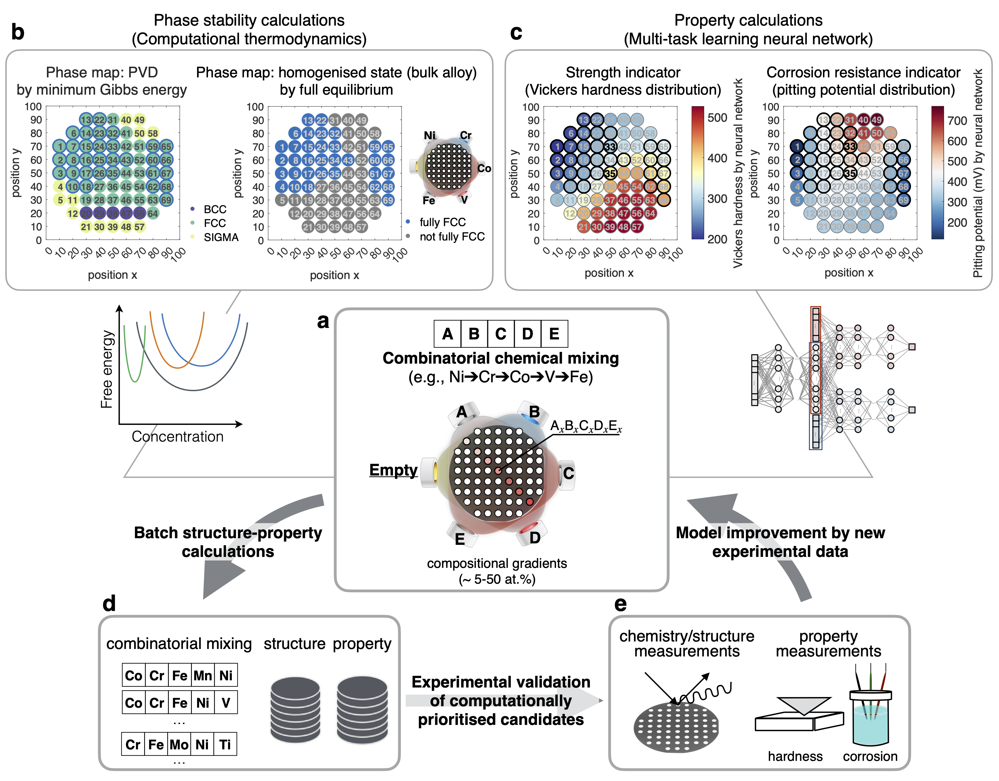

# Informing Combinatorial Exploration of Compositionally Complex Alloys

## Introduction

This repository helps to explain an integrated iterative workflow between computational methods (computational thermodynamics and multi-task learning neural networks) and combinatorial experimentation, to explore compositionally complex alloys (CCAs). The codebase includes several submodules implemented on different aspects of the research, ranging from computational thermodynamics calculations to machine learning algorithms.  



## Structure

- `./v6_A-B-C-D-E_Sputtering` - [repo](https://github.com/YXWU2014/combinatorial_mixing.git) contains codes for phase stabilities and solid solution strengthening calculations for permutative combinatorial mixed compositions.
- `./CCA_representation_ML` - [machine learning workflow](https://github.com/YXWU2014/CCA_representation_ML.git) for multitask learning neural network of hardness and corrosion properties.
- `./v6_A-B-C-D-E_Sputtering_ML` - computed structure and property results for permutative combinatorial mixed compositions (55 alloy families and 455,400 alloy compositions).

## Getting Started

### Tested dependencies

- Python 3.9.16
- Some key libraries listed in `requirements.txt`
- For customised classes and functions, see `./CCA_representation_ML/utils`

### How to use it

Pull the repository to the local folder

```bash
git clone https://github.com/YXWU2014/CCA_CALPHAD_SSS_ML.git
cd CCA_CALPHAD_SSS_ML
```

Add the submodule

```bash
git submodule add https://github.com/YXWU2014/CCA_representation_ML.git CCA_representation_ML

git submodule add https://github.com/YXWU2014/combinatorial_mixing.git v6_A-B-C-D-E_Sputtering
```

Initialise and fetch the submodule

```bash
git submodule update --init --recursive
git checkout main
```

## Acknowledgments

The authors gratefully acknowledge the support of the European Union's Horizon 2020 research and innovation programme under [Grant Agreement No. 958457](https://doi.org/10.3030/958457). The content of this publication does not reflect the official opinion of the European Union. Responsibility for the information and views expressed herein lies entirely with the authors.

<!-- ## License
This project is licensed under the [MIT License](LICENSE.md) - see the LICENSE file for details. -->

<!-- 
```bash
cd CCA_CALPHAD_SSS_ML

```

```bash
cd CCA_representation_ML
git add -A
git commit -m "update readme"
git push origin main

cd ..
git add  -A
git commit -m "update readme"
git push origin main
``` -->

<!-- 

# Informing combinatorial exploration of compositionally complex alloys

This repository provides a platform for performing calculations and evaluations on quinary alloys A-B-C-D-E using computational thermodynamics and machine learning techniques. It focuses on modelling the phase stability and solid solution strengthening, along with hardness and corrosion pitting potential evaluation.

## Objectives

This repository serves to:

- Perform batch calculations for quinary alloys (A-B-C-D-E) using computational thermodynamics.
  - Model phase stability under full equilibrium and minimum Gibbs energy conditions.
  - Model solid solution strengthening for the targeted alloys.
- Evaluate hardness and corrosion pitting potential using a multitask neural network model (based on the `CCA_representation_ML` submodule).
- Facilitate compositional sampling that takes the representation of combinatorial physical vapor deposition (`SputteringCompoMapNormalised.dat`) and permutations of different mixes of neighbouring elements.

## Visuals

The computational results can be illustrated through visuals such as the plots below, demonstrating the FCC alloy formation tendency under varying thermodynamic evaluations and property evaluations by physical-based models. They also show the solid solution strengthening and the properties computed from the neural network models.


## Citation

For more information, refer to:

- Wu et al., "Harnessing representation in exploring compositional complex alloys [under review]", 2023.

## Repository Structure and Features

The directory structure and functionalities are described as follows:

```bash
|-- CCA_CALPHAD_SSS_ML

    |-- v6_A_B_C_D_E_Gmin_FullEquil_SputterCompo_master.m
    |-- v6_A_B_C_D_E_SSS_SputterCompo_master.m
    |-- SputteringCompoMapNormalised.dat
    |-- v6_A_B_C_D_E_Gmin_FullEquil_SputterCompo_batch.m
    |-- v6_A_B_C_D_E_SSS_SputterCompo_batch.m

    |-- v6_A-B-C-D-E_Sputtering_ML

    |-- CCA_representation_ML

    |-- sns_plot.ipynb

|-- v6_Fe_Cr_Ni_Al_Si_Sputtering (not in this repository)
|-- v6_Fe_Cr_Ni_Al_Ta_Sputtering (not in this repository)
|-- ...

```

#### phase stability and solid solution strengthening calculation

`v6_A_B_C_D_E_Gmin_FullEquil_SputterCompo_master.m` performs calculations of phase stability under full equilibrium and minimum Gibbs energy, aiming at obtaining FCC alloys.
`v6_A_B_C_D_E_SSS_SputterCompo_master.m` models the solid solution strengthening for the FCC phase under the same sampled compositions.

#### Machine Learning Submodule

`CCA_representation_ML`: This machine learning submodule, maintained in a separate repository, is utilized for evaluating hardness and corrosion pitting potential.

#### Plotting

`sns_plot.ipynb` to generate summary plots

## tested working environment

```bash
conda create --name tf_1-env python=3.7
conda activate tf_1-env

pip install --upgrade pip
pip install tensorflow==1.14

pip install scikit-learn pandas matplotlib seaborn shap

```

## Download the repositories `CCA_CALPHAD_SSS_ML` and its submodule `CCA_representation_ML` to your local drive

```bash
|-- your local drive
    |-- CCA_CALPHAD_SSS_ML
        |-- CCA_representation_ML
        |-- ...
``` -->

<!-- **Commit and push local changes to GitHub**

**Pull the latest repository to the local folder (point to `main` branch)**

```bash
cd CCA_CALPHAD_SSS_ML
```

```bash
git pull origin main

cd CCA_representation_ML
git checkout main
git pull origin main
cd ..
```
-->
